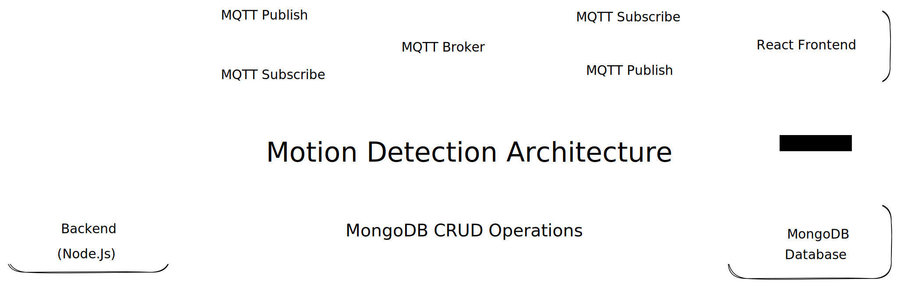

# Real-Time Motion Detection System

This project is a real-time motion detection system using an ESP8266 microcontroller, MQTT protocol, and a React + Vite frontend for displaying motion events in real-time. It involves sending motion detection data from an ESP8266 device, publishing the data to an MQTT broker, and displaying these events in a web-based dashboard.

## Table of Contents
- [Overview](#overview)
- [Features](#features)
- [Architecture and System Design](#architecture-and-system-design)
- [Prerequisites](#prerequisites)
- [Setup Instructions](#setup-instructions)
  - [ESP8266 Setup](#esp8266-setup)
  - [Backend Setup](#backend-setup)
  - [Frontend Setup](#frontend-setup)
- [Working](#working)
- [Future Enhancements](#future-enhancements)
- [License](#license)

## Overview
The system consists of three major parts:
1. **ESP8266 Microcontroller**: Detects motion using a PIR sensor and sends the motion data to an MQTT broker.
2. **Backend Server**: A Node.js server using MQTT to capture and store motion events in a MongoDB database.
3. **React + Vite Frontend**: A web interface that subscribes to the MQTT broker and displays motion events in real-time.

## Features
- Real-time motion detection using MQTT protocol.
- PIR sensor connected to ESP8266 to detect motion events.
- Web-based dashboard to view live motion logs.
- Backend powered by Node.js and MongoDB to store motion logs.
- Highly responsive interface with real-time updates using MQTT and WebSockets.

## Architecture and System Design

The system architecture is designed to facilitate real-time communication between the motion detection hardware and the user interface. Below is an overview of the architecture:

### Components Interaction:

1. **ESP8266 Microcontroller**:
   - **Motion Detection**: The ESP8266 is connected to a PIR motion sensor. It continuously monitors for motion.
   - **MQTT Publish**: When motion is detected, it publishes a message to the MQTT broker on the topic `motion-detection/events`.
   - **MQTT Subscribe**: Optionally, it can subscribe to topics if you wish to send commands from the backend or frontend to the ESP8266.

2. **MQTT Broker**:
   - Acts as a message broker that routes messages between publishers (ESP8266) and subscribers (Backend and Frontend).
   - Facilitates real-time communication using the publish/subscribe pattern.

3. **Backend Server (Node.js)**:
   - **MQTT Subscribe**: Subscribes to the `motion-detection/events` topic to receive motion events.
   - **Data Processing**: Upon receiving a motion event, it processes and stores the event in the MongoDB database.
   - **API Endpoints**: Provides RESTful API endpoints (e.g., `/api/motion-events`) for fetching stored motion events.
   - **Optional MQTT Publish**: Can publish messages back to the MQTT broker if needed (e.g., to control devices).

4. **MongoDB Database**:
   - Stores motion event logs with timestamps and motion status.
   - Enables persistent storage and retrieval of historical data.

5. **React + Vite Frontend**:
   - **MQTT Subscribe**: Subscribes directly to the `motion-detection/events` topic to receive real-time updates.
   - **Real-Time UI Update**: Updates the user interface immediately when a new motion event is received.
   - **HTTP GET Requests**: Can fetch historical motion events from the backend via API endpoints for display or analysis.

### Data Flow:

- **Motion Event Detection**:
  - The PIR sensor detects motion and the ESP8266 publishes a message to the MQTT broker.
- **Real-Time Updates**:
  - Both the backend server and the frontend application are subscribed to the MQTT broker.
  - They receive the motion event in real-time.
- **Data Storage**:
  - The backend processes the motion event and stores it in the MongoDB database.
- **User Interface Update**:
  - The frontend updates the motion log display immediately upon receiving the event.
- **Historical Data Access**:
  - The frontend can request historical data from the backend via HTTP GET requests to display past motion events.

### Why Use MQTT?

- **Efficiency**: MQTT is a lightweight messaging protocol ideal for small sensors and mobile devices.
- **Real-Time Communication**: Enables instant data transfer with minimal overhead.
- **Scalability**: Supports multiple subscribers and publishers, allowing for easy system expansion.
- **Decoupled Architecture**: Publishers and subscribers are independent, enhancing system flexibility.

### Technologies Used:

- **ESP8266**: Wi-Fi enabled microcontroller used for IoT applications.
- **PIR Sensor**: Passive Infrared Sensor for detecting motion.
- **MQTT Protocol**: Messaging protocol for IoT devices.
- **Node.js**: Server-side JavaScript runtime for the backend server.
- **MongoDB**: NoSQL database for storing motion events.
- **React + Vite**: Frontend framework and tooling for building the user interface.

## Prerequisites

Before starting the setup, make sure you have the following installed:
- **Node.js** and **npm**
- **MongoDB** database
- **Arduino IDE** (for ESP8266 programming)
- **MQTT Broker** (e.g., HiveMQ, Mosquitto)
- **React + Vite** for frontend development

## Setup Instructions

### ESP8266 Setup

1. **Hardware Requirements**:
   - ESP8266 microcontroller
   - PIR sensor
   - Jumper wires
   - Breadboard

2. **Pseudocode for ESP8266**:
   - Initialize the Wi-Fi connection.
   - Connect to the MQTT broker using the provided credentials.
   - Continuously check for motion using the PIR sensor:
     - If motion is detected:
       - Publish a message to the `motion-detection/events` topic indicating motion detected.
     - Else, publish a message indicating no motion.
   - Repeat the loop with a small delay to avoid spamming the network.

3. **Connections**:
   - Connect the PIR sensor's VCC, GND, and OUT to the ESP8266's 3.3V, GND, and D2 pin, respectively.

4. **MQTT Broker**:
   - Use a public MQTT broker like `broker.hivemq.com` or set up your own broker.

## Working

1. **ESP8266**:
   - Detects motion using a PIR sensor and publishes data to an MQTT broker (`motion-detection/events` topic).

2. **Backend**:
   - Subscribes to the MQTT topic, listens for incoming messages, and stores the motion events in a MongoDB database.

3. **Frontend**:
   - Subscribes to the MQTT broker and listens for real-time motion events, displaying them immediately in the web UI.

## Future Enhancements

- Implement user authentication to secure access to motion events.
- Visualize motion detection data over time using charts and graphs.
- Add support for multiple sensors and more complex event handling.

## License

This project is licensed under the MIT License.